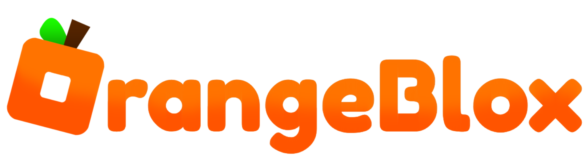
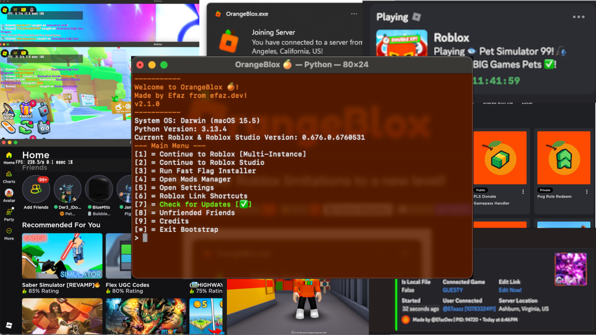

<h1 align="center"></h1>
<h2 align="center">Push your Roblox limitations to a new level!</h2>

    
    
    
        
    
        

     

> [!IMPORTANT]
> Hello! If you were an user of Efaz's Roblox Bootstrap on v1.5.9 or lower, you might have noticed we have rebranded to OrangeBlox! Any mods and data are transferred as of this change. For more information, [click here.](https://github.com/efazdev/orangeblox/wiki/Rebranding-to-OrangeBlox)

## What is OrangeBlox?
OrangeBlox is a Python [Console](https://www.google.com/search?q=developer+console+terminal&udm=2) program heavily inspired by Bloxstrap made for macOS and Windows that applies modifications onto the Roblox Client using files! It also uses [Activity Tracking](https://github.com/pizzaboxer/bloxstrap/wiki/What-is-activity-tracking%3F), supports [BloxstrapRPC](https://github.com/pizzaboxer/bloxstrap/wiki/Integrating-Bloxstrap-functionality-into-your-game) and a lot more!

> [!IMPORTANT]
> This GitHub repository, [EfazDev Project Page](https://www.efaz.dev/orangeblox), [obxbeta.efaz.dev](https://obxbeta.efaz.dev) and [obx.efaz.dev](https://obx.efaz.dev) is the only official way to install OrangeBlox! Please do not trust exe or installation files that claim to be OrangeBlox from other websites.

## Features
1. Set FFlag and Global Setting Customizations on your Roblox installation!
2. Install Mods including a custom Avatar Map, App Icon, Cursor, and Death Sound!
3. Customize with unlimited mods that you can download and insert an extracted folder copy into the Mods folder! *[Requires to go through bootstrap in Mods Manager]
4. Use multiple instances directly by launching from your default web browser or the OrangeBlox app!
5. Get server locations when joining (courtesy of ipinfo.io)
6. Apply the same experience to Roblox Studio with mods!
7. Discord Rich Presences [Includes Support for BloxstrapRPC]
8. Roblox Studio Support with Mods and FFlags! *[FFlags may not work due to future Roblox updates]
9. Discord Webhooks [Join, Disconnect, Teleport, Crash, BloxstrapRPC and More Notifications!]
10. Run Python Scripts based on events ran on the Roblox client using Mod Scripts!
11. Play Roblox/Run Studio app so you can run Roblox directly!
12. Included Mods and Mod Scripts that could be used for free!
13. Read Logs from Roblox using RobloxFastFlagsInstaller *[Requires Debug Mode]!
14. Roblox Early Program Support with Roblox Security Cookie Usage enabled (in v2.4.0i+ or v2.4.0+)
15. Localization from other languages! Other languages available (English may be needed for understanding installation): Arabic, Bengali, Chinese (Simplified), Chinese (Traditional), Danish, German, Greek, French, Filipino, Georgian, Hindi, Indonesian, Italian, Japanese, Korean, Portuguese, Russian, Spanish, Thai, Turkish, Ukrainian, Urdu, Vietnamese
16. Way more features to be explored!
> [!NOTE]
> Features may be needed to be enabled in order to be used. Check the Settings from the main menu in order to find and enable.

## Requirements
1. [Latest ZIP of OrangeBlox](https://github.com/EfazDev/orangeblox/releases/latest)
2. [Windows 10.0.17763+ (October 2018)](https://www.microsoft.com/en-us/software-download/) or [macOS 10.13+ (High Sierra)](https://apps.apple.com/us/app/macos-high-sierra/id1246284741)
3. [Python 3.11+](https://www.python.org/downloads/) [You may install Python 3.14.0 from InstallPython.bat (Windows) or from InstallPython.sh (macOS)]
4. Python Modules:  
   macOS: pip install pypresence pyobjc-core pyobjc-framework-Quartz pyobjc-framework-Cocoa posix-ipc psutil  
   Windows: pip install pypresence pywin32 plyer psutil

## Install
1. Once you have installed Python 3.11 or higher and downloaded the ZIP file, extract the full ZIP into a new folder.
2. After you have EXTRACTED the folder, open it and make sure you see Install.py. Once you do, run it.
2. Complete the installation process and once it says success, run the bootstrap by using the Launchpad for macOS or by using the Search Menu for Windows.
3. Complete the tutorial about how to use the bootstrap.
4. Done! You have installed OrangeBlox!
> [!NOTE]
> If there's an error during the installation process, try checking if your computer is supported or if something was edited that may cause this error. macOS may also edit permissions of the files if run under an admin account, keep an insight of that.

## Anti-Virus Information
> [!IMPORTANT]
> OrangeBlox is a safe Windows/macOS program and won't harm your Roblox account. However, compilers like Nuitka and pyinstaller may have some issues where apps created contain false positives from anti-virus software. For example, Windows Defender may detect the bootstrap with Win32/Wacapew.C!ml. In order to prevent this, you may need to authorize the app through your anti-virus or build the app directly.

## Python 3.15 Beta Support
> [!IMPORTANT]
> OrangeBlox is compatible with beta versions of Python such as Python 3.15. However, Pypi packages such as pyobjc, Nuitka/pyinstaller, psutil and plyer will all need to support the Python beta in order to work with OrangeBlox. Using beta versions of Python is only recommended for developers that know what they're doing and is not recommended for public use.

## Hashes
| File | MD5 Hash |
| --- | --- |
| Main Bootstrap (Main.py) | `1aef95af1698f7d598125422c7b5604e` |
| Roblox FFlag Installer (RobloxFastFlagsInstaller.py) | `c1033042505cb6aebadd9906487ffebd` |
| Installer (Install.py) | `a46b005fc6376b57cf3de2e7603a9fb5` |
| Bootstrap API (OrangeAPI.py) | `58d6bccbb716fd913c77e119dd99b6d7` |
| Bootstrap Loader (OrangeBlox.py) | `c74d3b8e0558bf364d212405f6146e0f` |
| Discord Presence Handler (DiscordPresenceHandler.py) | `3f288f813808f13ae3958abea59780cd` |
| PyKits API (PyKits.py) | `f9a3e8c32ca0e9c0fa9975f0544843d4` |

## Credits
1. Made by 
2. Old Player Sounds and Cursors were sourced from 
3. Avatar Editor Maps were from  slightly edited to be usable for the current version of Roblox (as of the time of writing this)
4. The Kliko's Mod Tool Mod Script was edited and made from 
5. Python Module Creators: , , , , , 
6. Server Locations was made thanks to  as it wouldn't be possible to get IP address locations without them!
7. The logo of OrangeBlox was made thanks of . Thanks :)
8. macOS App was built using  and . You can recreate and deploy using this command: `python3 Install.py -r -rp -rc`
9. Windows App was built using . You can recreate and deploy using this command: `python3 Install.py -r -rp`
> [!IMPORTANT]
> This command can be depending on the native operating system your computer has. For example, if you're running Windows on arm64, you can rebuild full Windows OrangeBlox if you install Python in arm64, x86 and x64 while including the `--full-rebuild` argument while in normal x64, you can only rebuild x86. The argument `--rebuild-clang` is only available in macOS and requires Xcode Command Tools to be installed. Pyinstaller is more suggested for quick testing and easier rebuilds while Nuitka requires a C compiler to be installed on your computer (use Microsoft Visual Studio 2022 for compilation). For more information about Nuitka compiling, use this manual: https://nuitka.net/user-documentation/user-manual.html