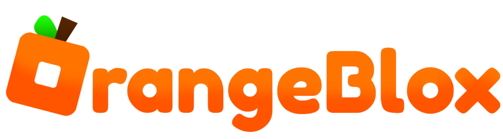
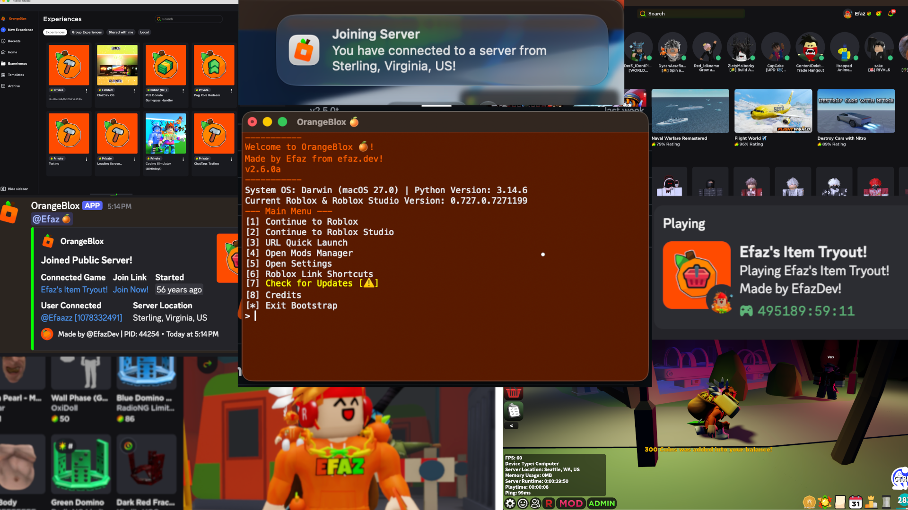

<h1 align="center"></h1>
<h2 align="center">Push your Roblox limitations to a new level!</h2>

    
    
    
        
    
        

     

## What is OrangeBlox?
OrangeBlox is a Python [Console](https://www.google.com/search?q=developer+console+terminal&udm=2) program heavily inspired by Bloxstrap made for macOS and Windows that applies modifications onto the Roblox Client using files! It also uses [Activity Tracking](https://github.com/pizzaboxer/bloxstrap/wiki/What-is-activity-tracking%3F), supports [BloxstrapRPC](https://github.com/pizzaboxer/bloxstrap/wiki/Integrating-Bloxstrap-functionality-into-your-game) and a lot more!

> [!IMPORTANT]
> This GitHub repository, [EfazDev Project Page](https://www.efaz.dev/projects/orangeblox), [obxbeta.efaz.dev](https://obxbeta.efaz.dev) and [obx.efaz.dev](https://obx.efaz.dev) is the only official way to install OrangeBlox! Please do not trust exe or installation files that claim to be OrangeBlox from other websites.

## Features
1. Mods Support: Apply multiple kinds of mods that range from Cursors to full on custom colors!
2. Mod Creation (using Kliko Mod Tool Script in Mod Scripts): Create gradient based mods visuals automatically everytime Roblox updates!
3. Roblox Studio Support: OrangeBlox supports running Roblox Studio with FFlag Support and Mods!
4. Native macOS and Windows Support: OrangeBlox supports running and handling Roblox on Windows and macOS!
5. Mod Scripts: Run your own Python scripts that help automate actions using OrangeAPI!
6. Discord RPC: OrangeBlox supports running Discord RPC using Activity Tracking!
7. Server Locations: OrangeBlox supports getting Server Locations and Uptime using freeipapi.com and RoValra!
8. Discord Webhooks: OrangeBlox supports sending Discord messages using Webhooks to help notify you when you disconnect from a game, join a game, when Roblox opens, etc!
9. Bloxstrap RPC Support: OrangeBlox supports games that use Bloxstrap RPC to interact with your Discord RPC!
10. Launcher Apps: OrangeBlox automatically adds Launcher apps to your Desktop for automatic launching Roblox or Roblox Studio
11. Roblox Early Access Program Support: With Roblox Security Cookie Usage, OrangeBlox supports installing Early Access Roblox installations offered by Roblox's API.
12. Localization with 23 Other Languages besides English!

| Language | Native |
| --- | --- |
| Arabic | العربية |
| Bengali | বাংলা |
| Chinese (Simplified) | 简体中文 |
| Chinese (Traditional) | 繁體中文 |
| Danish | Dansk |
| German | Deutsch |
| Greek | Ελληνικά |
| French | Français |
| Filipino | Filipino |
| Georgian | ქართული |
| Hindi | हिन्दी |
| Indonesian | Bahasa Indonesia |
| Italian | Italiano |
| Japanese | 日本語 |
| Korean | 한국어 |
| Portuguese | Português |
| Russian | Русский |
| Spanish | Español |
| Thai | ไทย |
| Turkish | Türkçe |
| Ukrainian | Українська |
| Urdu | اردو |
| Vietnamese | Tiếng Việt |

13. Way more features to be explored!
> [!NOTE]
> Features may be needed to be enabled in order to be used. Check the Settings from the main menu in order to find and enable.

## Requirements
1. [Latest ZIP of OrangeBlox](https://github.com/EfazDev/orangeblox/releases/latest)
2. [Windows 10.0.17763+ (October 2018)](https://www.microsoft.com/en-us/software-download/) or [macOS 10.15+ (Catalina)](https://apps.apple.com/us/app/macos-catalina/id1466841314)
3. [Python 3.11+](https://www.python.org/downloads/) [You may install Python 3.14.7 from InstallPython.bat (Windows) or from InstallPython.command (macOS)]
4. Python Modules:  
   macOS: pip install pypresence pyobjc-core pyobjc-framework-Quartz pyobjc-framework-Cocoa posix-ipc psutil truststore  
   Windows: pip install pypresence pywin32 plyer psutil truststore

## Install
1. Once you have installed Python 3.11 or higher and downloaded the ZIP file, extract the full ZIP into a new folder.
2. After you have EXTRACTED the folder, open it and make sure you see Install.py. Once you do, run it.
2. Complete the installation process and once it says success, run the bootstrap by using the Launchpad for macOS or by using the Search Menu for Windows.
3. Complete the tutorial about how to use the bootstrap.
4. Done! You have installed OrangeBlox!
> [!NOTE]
> If there's an error during the installation process, try checking if your computer is supported or if something was edited that may cause this error. macOS may also edit permissions of the files if run under an admin account, keep an insight of that.

## Anti-Virus Information
> [!IMPORTANT]
> OrangeBlox is a safe Windows/macOS program and won't harm your Roblox account. However, compilers like Nuitka and pyinstaller may have some issues where apps created contain false positives from anti-virus software. For example, Windows Defender may detect the bootstrap with Win32/Wacapew.C!ml. In order to prevent this, you may need to authorize the app through your anti-virus or build the app directly.

## Python 3.15 Beta Support
> [!IMPORTANT]
> OrangeBlox is compatible with beta versions of Python such as Python 3.15. However, Pypi packages such as pyobjc, Nuitka/pyinstaller, psutil and plyer will all need to support the Python beta in order to work with OrangeBlox. Using beta versions of Python is only recommended for developers that know what they're doing and is not recommended for public use.

## Hashes
| File | SHA256 Hash |
| --- | --- |
| Bootstrap API (OrangeAPI.py) | `b513767b647fa2fdc0a8b8a816f404de6bb17e0665588e8797e240c2e05f77af` |
| PyKits API (PyKits.py) | `181b982c486fcf913a9eb4fd1002e092418f5f972a6afdff6255566b8c1c890c` |
| Roblox Manager (RobloxManager.py) | `7e5cf1e7c87afc99683229ea084b5ada8ecc6d2c94f9c1ef4e6a2e6eed991648` |
| Installer (Install.py) | `0cd23cc5cd12be29a2e4293b863a2b066eda3394639dbc6d8edf8fa2a2bbbdf6` |
| Main Bootstrap (Main.py) | `1fa502de4370c36a5ff13d20771cee28149bd06b2324dd464757b5a06fb2fb56` |
| Mod Manager Module (Modules/modmanager.py) | `aa0e25945c3db93f49773186c29c9ad1d3d8061965e31c67d434d5daa5b18df0` |
| Menu Options Module (Modules/options.py) | `644057b781861fcce2101b0fd1adb973174b4b48e554b823c544f4bfffdc124c` |
| Startup Module (Modules/startup.py) | `4c3b6f3953aeca489259524d5068b6f83a4ed22ab48f68a6e233f7b7c72aa059` |
| Configuration Module (Modules/config.py) | `1e6c2532c10422e50acfaee044ce9601b19a19d577496e64b807b752b0eb1184` |
| Mod Scripts Module (Modules/modscripts.py) | `10ced77f9a15fa4deb39fe7c5ccd44afe7d4d009c689ffb020cfddb29de41409` |
| Discord RPC Module (Modules/discord.py) | `a1a7a9f3177a23c10df48dcfd14938fcae0324a3a584806b0a0d75c4e95d9480` |
| Roblox Module (Modules/roblox.py) | `febbfdcdfe5d035a2a7c8986d7370bdc8bb2ceb64f21b7532716a61bbc622ac2` |
| Menu Module (Modules/menu.py) | `d993ac77685f61c7a2916e21d4507f1923a21a578b5dbafb7ba21909938ae44d` |
| Utilities Module (Modules/utils.py) | `f8ceaba0eca97cf33480127e27c42f8576c51ebf554c557bd9d1a7a8f0bca394` |
| Settings Module (Modules/settings.py) | `1eb605b5c979d03e227784724bee8109a806c3fa9e56e6bcf6832012b7db8bce` |
| Python Package Module (Modules/pkg.py) | `37aef07b696822ac9f47d46cb19308079a6f913b11cdf817be0bb1a6823d6be6` |
| Printing/Logging Module (Modules/printing.py) | `2755ee709dfa2321b3b22ebacdcf327db1fe7f4706baa0a840167ace9a2fdd2a` |
| Bootstrap Loader (OrangeBlox.py) | `ed8ac14d28e2318b036398963e74a3f88e5bdff1d6de5611c733fe5d53ce9f11` |

## Credits
1. Made by 
2. Old Player Sounds and Cursors were sourced from 
3. Avatar Editor Maps were from  slightly edited to be usable for the current version of Roblox (as of the time of writing this)
4. The Kliko's Mod Tool Mod Script was edited and made from 
5. Python Module Creators: , , , , , ,  
6. Server Locations are sourced from 
7. Server Uptimes are sourced from 
8. The logo of OrangeBlox was made thanks of . Thanks :)
9. macOS App was built using  and . You can recreate and deploy using this command: `python3 Install.py -r -rp -rc`
10. Windows App was built using . You can recreate and deploy using this command: `python3 Install.py -r -rp`
> [!IMPORTANT]
> This command can be depending on the native operating system your computer has. For example, if you're running Windows on arm64, you can rebuild full Windows OrangeBlox if you install Python in arm64, x86 and x64 while including the `--full-rebuild` argument while in normal x64, you can only rebuild x86. The argument `--rebuild-clang` is only available in macOS and requires Xcode Command Tools to be installed. Pyinstaller is more suggested for quick testing and easier rebuilds while Nuitka requires a C compiler to be installed on your computer (use Microsoft Visual Studio 2022 for compilation). For more information about Nuitka compiling, use this manual: https://nuitka.net/user-documentation/user-manual.html